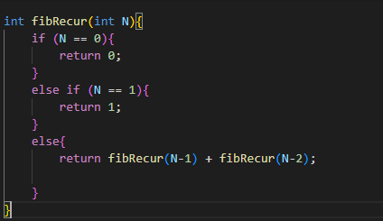
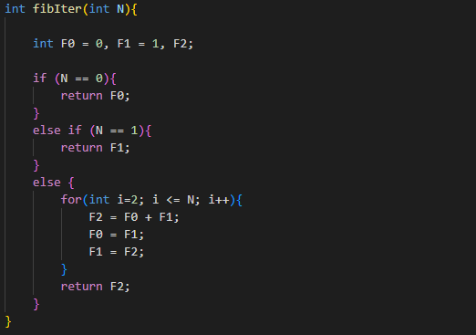

# Measuring the Time and Space complexity of a Fibonacci algorithm: Recursive vs. Iterative

In this repo, I will be comparing the time and space complexity between the iterative and recursive approach to finding the nth value of a Fibonacci sequence.
Let's first start by showing how the iterative and recursive algorithm works.

## Recursive
A recursive function is defined as a function that calls itself during its execution once or more. This function is very useful for many different types of problems as it allows programmers to write very efficient programs using minimal amounts of code. Below is an example of a recursive function used to find the nth value of a Fibonacci sequence: 
 

## Iterative
An iterative program is a program that runs its code repetitively until a specific wanted end result is achieved.
Below is an example of an iterative program used to find the nth value of a Fibonnaci sequence:
 
 

## Testing
In this section, I will be testing the functionality of my recursive and iterative codes.
 
To do this:
 1. Run command prompt
 
2. Direct to the "fibonacci-benchmark" folder using cd <folder path
 
3. Compile the C file by using gcc -o mylib.o -c mylib/mylib.c; gcc -o main.exe main.c mylib.o
 
4. Run the executable file by using main.exe for Windows and ./main.out for Linux and macOS
 
5. Input the nth value you want to find in the Fibonnaci sequence
 
 
The result will be shown as below:
 

From the results that I have obtained above, it can be seen that the same output from the iterative and recursive algorithm for a Fibonacci sequence of an input N=9 was returned. This shows the validity of both my iterative and recursive code implementation.

## Benchmarking
As can be seen from the previous section, the results of the two algorithm are the same. So what differentiates the two and which one is better?
To find out, we can compare their time and space complexities.
 

### Time complexity
The time complexity of an algorithm can be defined as the amount of time taken by an algorithm to run, as a function of the length of the input. It measures the time taken to execute each statement of code in an algorithm.In this section, I will be finding the time complexity of the two algorithms.
 
 
For this test, I will be using the Nth value 30
#### Recursive
To find the time complexity of the recursive program:

 1. Open terminal and direct to the "fibonacci-benchmark" folder using cd<folder path
 2. run make time-recursive; ./main_b_time_recursive.out
 
 
The result when N = 30 is as shown below:
 
 

 

  
#### Iterative
To find the time complexity of the iterative program:

 1.Repeat the same steps from before but replace the second step with Run make time-iterative; ./main_b_time_iterative.out
 
 
The result when N = 30 is as shown below:
 
 

  
   
  
### Space complexity
The space complexity of an algorithm is defined as the amount of memory an algorithm takes to run as a function of the length of the input. Space complexity is a way to evaluate the performance of an algorithm. In this section, I will be finding the space complexity of the two algorithms.
 
 
For this test, I will be using the Nth value 10000
   
#### Recursive
To find the space complexity of the recursive program:
 
 1. Search "Command Prompt" and run it
 2. Direct to the "fibonacci-benchmark" folder using cd <folder path
 3. Run make space-recursive; main_b_space_recurive.exe
 4. Do not close the Command Prompt
 
 

#### Iterative
  
To find the space complexity of the iterative program:

 1. Repeat steps 1,2,4 from before
 2. Replace step 3 with run make space-iterative; main_b_space_iterative.exe

#### Results:
To see and compare the space complexities :
 
Open "Task Manager" and search main_b_space_iterative and main_b_space_recursive
  
The results will be shown as below:
 

## Conclusion
From the results shown on the previous sections, we can conclude that:
 

#### 1. The recursive approach is slower as when finding the 30th value, it took 0.11504s to execute, while it took the iterative algorithm 0.00001s to execute.
This is because for the iterative approach, the program loop n number of times to find the nth Fibonacci number, making the time complexity linear. For the recursive algorithm however, the program has to call two additional recursive functions for each recursion before it can obtain the nth Fibonacci number, making the time complexity exponential. Running a loop repeatedly takes less time than calling and returning a function.
 

#### 2. The recursive algorithm takes up more space and memory as when finding the 10000th value, it took up 1.8 MB of memory. While for the iterative algorithm, it took up 1.3MB of space. 
This is due to the fact that for the recursive algorithm, stack memory is used up for every recursion call. Thus, the need for memory increases when nth value increases.
  

